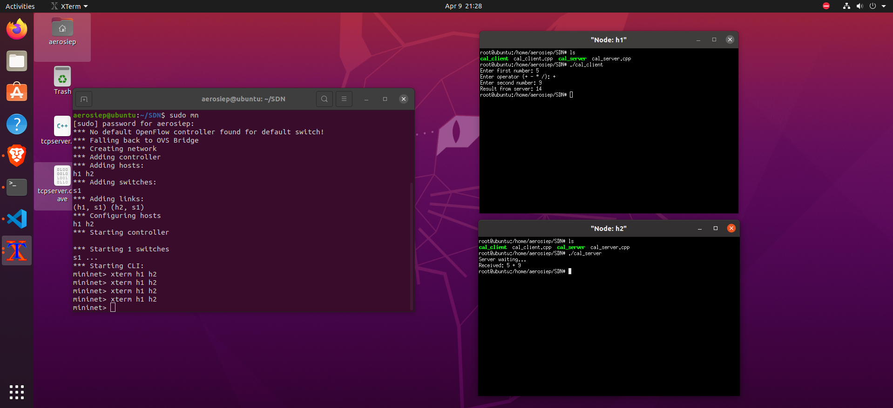

# Assignment 2: Arithmetic Server

## Objective
Client sends two numbers and operator.
Server calculates and sends result.

## How to run

Compile:
g++ cal_server.cpp -o server
g++ cal_client.cpp -o client

Run:
Terminal 1 → ./server  
Terminal 2 → ./client

## Output

Client side:
Enter first number: 5  
Enter operator (+ - * /): +  
Enter second number: 9  
Result from server: 14

## Screenshot

