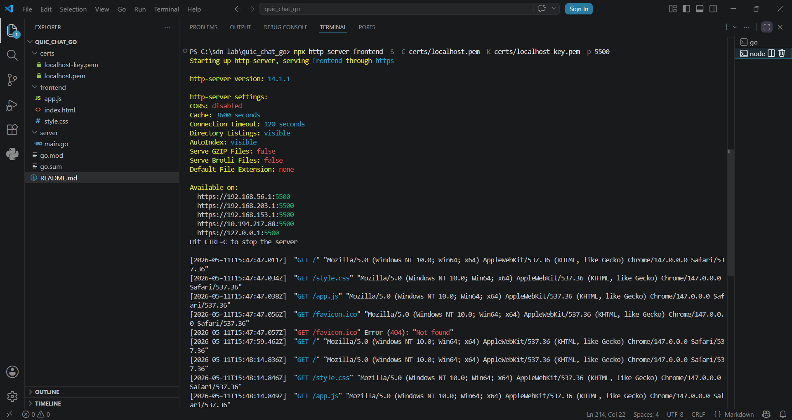
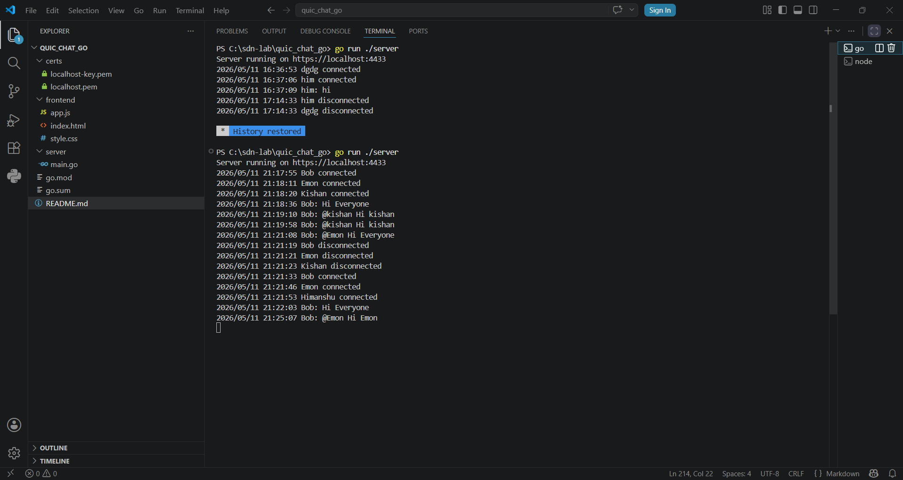
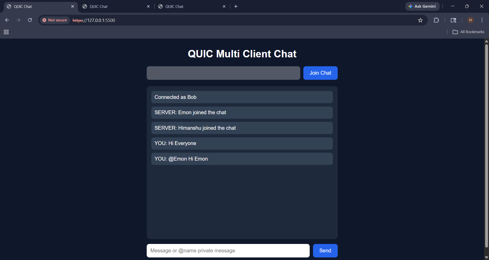
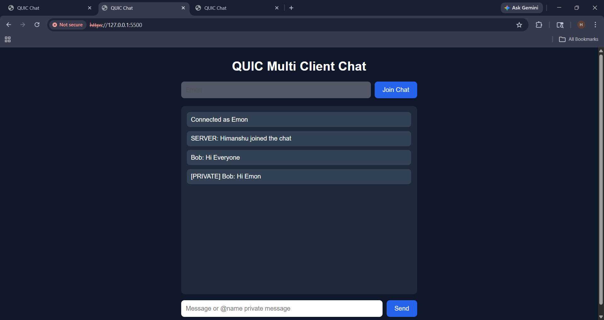
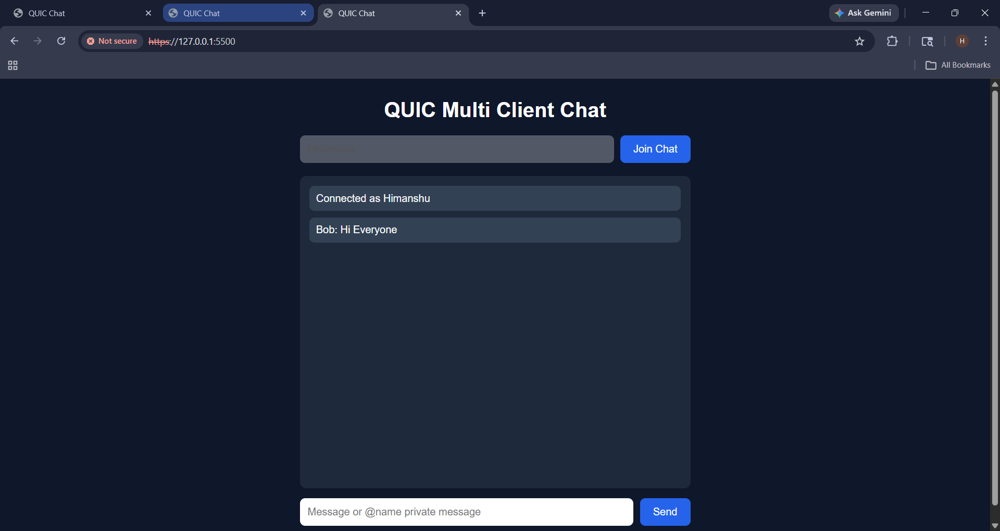

# QUIC Multi Client Chat

A secure multi-client real-time chat application built using Go, WebSocket communication, HTTPS, and JavaScript frontend.

---

# Project Overview

This project demonstrates:

* Multi-client communication
* Real-time chat system
* Broadcast messaging
* Private messaging using `@username`
* Secure HTTPS + WSS communication
* Client-server networking architecture

The application was developed for Software Defined Networking (SDN) lab experimentation and networking concepts.

---

# Technologies Used

## Backend

* Go
* Gorilla WebSocket
* net/http

## Frontend

* HTML
* CSS
* JavaScript

## Security

* HTTPS
* TLS/SSL Certificates
* mkcert

---

# Features

* Real-time chat
* Multiple clients support
* Username-based login
* Broadcast messaging
* Private messaging
* Secure browser communication
* Modern responsive UI

---

# Project Structure

```bash
quic_chat_go/
│
├── certs/
│   ├── localhost.pem
│   └── localhost-key.pem
│
├── frontend/
│   ├── index.html
│   ├── style.css
│   └── app.js
│
├── server/
│   └── main.go
│
├── go.mod
├── go.sum
└── README.md
```

---

# Workflow

```text
Browser UI  <---- Secure WebSocket ---->  Go Backend Server
```

1. User opens browser frontend.
2. User enters username.
3. Frontend creates secure WebSocket connection.
4. Go backend accepts connection.
5. Messages are broadcast to all users.
6. Private messages are sent using `@username`.

---

# Certificates Used

The project uses locally trusted SSL certificates generated using:

```bash
mkcert localhost
```

Generated files:

```bash
localhost.pem
localhost-key.pem
```

Purpose:

* Enable HTTPS
* Enable secure WebSocket communication
* Allow browser trust for localhost testing
* Encrypt communication between client and server

---

# Installation and Setup

## Step 1 — Install Dependencies

Install:

* Go
* Node.js
* mkcert

---

## Step 2 — Install Go Libraries

```bash
go get github.com/gorilla/websocket
```

---

## Step 3 — Generate Certificates

```bash
mkcert -install
mkcert localhost
```

Move generated files into:

```bash
certs/
```

---

# Running the Project

## Start Backend Server

```bash
go run ./server
```

Backend runs on:

```bash
https://localhost:4433
```

---

## Start Frontend Server

```bash
npx http-server frontend -S -C certs/localhost.pem -K certs/localhost-key.pem -p 5500
```

Frontend runs on:

```bash
https://localhost:5500
```

---

# Usage

## Broadcast Message

```text
hello everyone
```

Message is sent to all connected clients.

---

## Private Message

```text
@alex hello privately
```

Message is only sent to the specified user.

---


# Screenshots

## Frontend UI



## Backend Running



## UI Image 1



## UI Image 2



## UI Image 3



---

# Networking Concepts Demonstrated

* Client-server architecture
* Secure communication
* HTTPS
* TLS/SSL
* Real-time communication
* WebSocket protocol
* Concurrent client handling
* Broadcast communication
* Private messaging

---

# Future Improvements

* Online users list
* Typing indicator
* File sharing
* Database integration
* Better authentication
* Full QUIC/WebTransport implementation

---

# Author

Himanshu Dihingia
